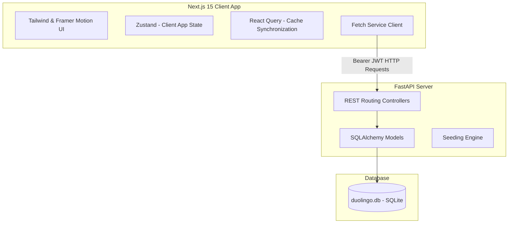
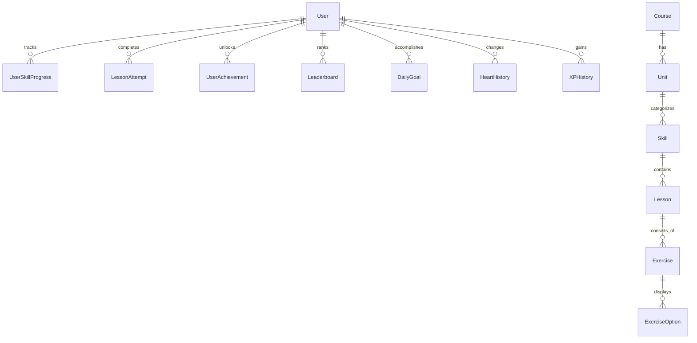

# Production-Quality Duolingo Web App Clone

A full-stack, production-quality clone of the Duolingo web application built for the SDE assignment. This project features a Next.js 15 frontend styled with Tailwind CSS, animated with Framer Motion, and state-managed using Zustand + React Query. The backend is a Python FastAPI service paired with SQLAlchemy ORM and SQLite, including comprehensive database migrations and mock seeding.

---

## Tech Stack

### Frontend
- **Next.js 15 (App Router)**: Framework for high-performance React applications.
- **TypeScript**: Static typing for interface safety.
- **Tailwind CSS v4**: Modular, responsive styling with custom Dark Mode theme tokens.
- **Framer Motion**: Micro-interactions, spring transitions, and card popovers.
- **React Query (TanStack)**: Server state cache synchronization.
- **Zustand**: Lightweight client state management.
- **React Hook Form**: Form validation.
- **Lucide Icons**: High-quality visual assets.
- **Canvas Confetti**: Celebration triggers on lesson completions.
- **HTML5 Speech Synthesis**: Native auto-accent Text-to-Speech reader.

### Backend
- **Python**: Core programming language.
- **FastAPI**: High-performance async web framework.
- **SQLAlchemy ORM**: Relational database mapper.
- **Pydantic**: Input/output serialization schemas.
- **SQLite**: Local relational database.
- **Direct Bcrypt Hashing & JWT**: Secured user registration, password verification, and session state.

---

## System Architecture



---

## Project Structure

```text
Duolingo/
├── backend/
│   ├── routers/
│   │   ├── auth.py          # User registration, login, JWT token operations
│   │   ├── courses.py       # Retrieve courses and select current course
│   │   ├── lessons.py       # Lesson data and answer validation
│   │   ├── users.py         # Update Hearts/XP, track daily goal progress
│   │   ├── leaderboard.py   # League ranks and weekly XP standings
│   │   └── achievements.py  # User milestones and badge unlocking
│   ├── auth_utils.py        # Hashing and JWT utilities
│   ├── database.py          # SQLAlchemy SQLite connection setup
│   ├── models.py            # DB schema definitions
│   ├── schemas.py           # Pydantic schema validation
│   ├── crud.py              # Business logic database queries
│   ├── seed.py              # Database seeder with English course
│   ├── requirements.txt     # Python backend dependencies
│   └── main.py              # Backend entry point
└── frontend/
    ├── src/
    │   ├── app/
    │   │   ├── lesson/[id]/ # Interactive Lesson Player (with TTS support)
    │   │   ├── leaderboard/ # Weekly League Ranks
    │   │   ├── quests/      # Daily Quests & Monthly Challenges
    │   │   ├── shop/        # Shop panel (Gems refilling hearts)
    │   │   ├── profile/     # Statistics and Join Info
    │   │   ├── settings/    # Account configurations & Daily Goals form
    │   │   ├── globals.css  # Global styles and dark mode rules
    │   │   ├── layout.tsx   # Base shell layout with auth router guard
    │   │   └── page.tsx     # Landing page / Learning Path map
    │   ├── components/
    │   │   ├── AuthPage.tsx # Auth wizard UI
    │   │   ├── Providers.tsx# Query Client Provider
    │   │   ├── Sidebar.tsx  # Global Navigation drawer (theme & logout)
    │   │   ├── StatsPanel.tsx# Right stats drawer with Duo Mascot
    │   │   └── LearningPathMap.tsx # Grid map showing units & connecting lines
    │   ├── services/
    │   │   └── api.ts       # Central HTTP fetch helper
    │   ├── store/
    │   │   ├── useUserStore.ts   # Zustand User Store
    │   │   └── useLessonStore.ts # Zustand Lesson Player Store
    │   └── AppGuard.tsx     # Session router guard
    ├── package.json
    └── tsconfig.json
```

---

## Relational Database Schema

This application deploys a relational schema in SQLite. Relationships are specified via foreign keys and SQLAlchemy ORM `relationship` layers:



---

## REST API Documentation

| Endpoint | Method | Authentication | Description |
| :--- | :--- | :--- | :--- |
| `/api/auth/register` | `POST` | None | Create a new user account |
| `/api/auth/login` | `POST` | None | Authenticate credentials and return JWT bearer token |
| `/api/auth/me` | `GET` | Required | Retrieve profile details of authenticated user |
| `/api/courses` | `GET` | None | List available language courses |
| `/api/courses/{id}` | `GET` | None | Fetch course tree (Units -> Skills -> Lessons -> Exercises) |
| `/api/courses/select/{id}` | `POST` | Required | Select the active course for the learner |
| `/api/lessons/{id}` | `GET` | Required | Retrieve lesson detail with exercise lists |
| `/api/lessons/submit-answer` | `POST` | Required | Evaluate exercise input and grade accuracy |
| `/api/lessons/complete` | `POST` | Required | Record completion status, add XP, adjust hearts, and update streak |
| `/api/users/update-hearts` | `POST` | Required | Refill or adjust user hearts |
| `/api/users/update-xp` | `POST` | Required | Increment user XP points |
| `/api/users/daily-goal` | `GET` | Required | Retrieve daily goal progress for active user |
| `/api/leaderboard` | `GET` | Required | Fetch weekly league standings (Bronze, Silver, Gold) |
| `/api/achievements` | `GET` | Required | Retrieve user milestone unlock progress |

---

## Installation & Running Locally

### Backend Server Setup
1. Navigate to the backend directory:
   ```bash
   cd backend
   ```
2. Create and activate a python virtual environment:
   ```bash
   python -m venv .venv
   # Windows:
   .venv\Scripts\activate
   # macOS/Linux:
   source .venv/bin/activate
   ```
3. Install dependencies:
   ```bash
   pip install -r requirements.txt
   ```
4. Start the FastAPI server (auto-seeds database on startup):
   ```bash
   uvicorn main:app --reload --port 8000
   ```
   *Swagger API interactive docs will be available at `http://127.0.0.1:8000/docs`.*

### Frontend App Setup
1. Navigate to the frontend directory:
   ```bash
   cd ../frontend
   ```
2. Install dependencies:
   ```bash
   npm install --legacy-peer-deps
   ```
3. Start the Next.js development server:
   ```bash
   npm run dev
   ```
   *Open `http://localhost:3000` to view the application in the browser.*
   *Demo login credentials:* `hemant@duolingo.com` / `password123`.

---

## Deployment Guidelines

### Frontend (Vercel)
Deploy your frontend repository to Vercel:
1. Set the Root Directory to `frontend`.
2. Configure environment variables (if any) and trigger the build.

### Backend (Render / Railway)
Deploy the backend Python service:
1. Set the Root Directory to `backend`.
2. Configure start command: `uvicorn main:app --host 0.0.0.0 --port $PORT`.
3. Set environment variable `SECRET_KEY` for secure JWT encryption.

---

## Interview Explanation & Best Practices

1. **State Isolation**: Client states (exercise progress, selections, word banks) are separated from global authentication and profile data. We utilize **Zustand** for lightweight, fluid transient components like the active Lesson Player, and **React Query** for caching server records like Leaderboard standings or Achievement progress.
2. **Relational Database Design**: Direct tables with proper foreign keys in SQLite ensure progress is not lost on page refreshes. Every lesson attempt, XP addition, and heart deduction is written to the database.
3. **Optimized Seeding**: The database is seeded on startup with an entire English learning path, containing multiple exercise types (Multiple Choice, Word Bank chips, Fill in the Blank, Type Answer, and Match Pairs) providing high-fidelity interaction.
